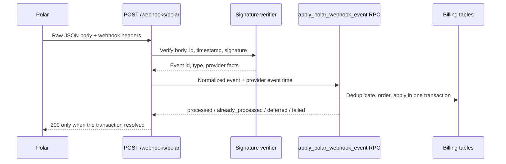

# Billing and Polar webhooks

Polar is the commerce provider; Supabase is Talven’s local billing state and
usage ledger. The browser starts checkout and displays local state, but only a
verified provider event or a bounded reconciliation pass changes local billing
records.

For the owner setup path across tests, local sandbox, staging, and production,
including product mapping and the exact evidence each environment can provide,
see [Polar environments and testing](../runbooks/polar-environments-and-testing.md).

## Plan and identity mapping

Polar calls an offer a product; Talven stores a versioned plan. A checkout
starts with Talven's `plans.id`, resolves that row's environment-specific
`polar_product_id`, and sends the signed-in Supabase user UUID as
`external_customer_id`. That user UUID is the join between the provider event
and Talven's local billing owner. Sandbox and production use different Polar
product UUIDs for the same Talven plan code and version.

A checkout return page is not payment evidence. It only says the browser came
back. The verified webhook or reconciliation path below must commit the local
order and entitlement before the application treats payment as settled.

Talven creates a 24-hour `billing_sync_operations` row for each checkout or
refund request. Checkout metadata carries the opaque operation UUID into the
resulting Polar order, and the success URL returns the same UUID to the billing
page. Refund operations are linked to the owned Polar order. The authenticated
`GET /billing/operations/{operation_id}` endpoint filters by both operation and
current user; unknown, expired, and other-user identifiers all return the same
not-found response.

After the authoritative webhook transaction commits, a separate atomic
database command resolves the browser operation only when its UUID, owner,
operation type, plan, Polar order, and terminal transition agree. Missing or
mismatched metadata is logged as a correlation failure but does not roll back a
valid billing update. Duplicate matching resolution is idempotent.

## What a webhook is

A webhook is an HTTP request that one service sends to another when something
happens. Talven does not continuously ask Polar whether somebody paid. Polar
sends a signed event to:

```text
POST https://<talven-api>/webhooks/polar
```

A simplified paid-order event looks like this:

```json
{
  "id": "evt_order_paid_001",
  "timestamp": "2026-07-29T10:00:00Z",
  "type": "order.paid",
  "data": {
    "id": "ord_replay_001",
    "customer_external_id": "<supabase-user-uuid>",
    "customer_id": "cus_replay_001",
    "product_id": "<polar-product-uuid>",
    "currency": "usd",
    "total_amount": 3000
  }
}
```

This is the replay-test shape, shortened to explain the identifiers. It is not
evidence for a live taxable checkout. The real request also carries signature,
event-ID, and timestamp headers.

Conceptually, the handler does this:

```python
@router.post("/webhooks/polar")
async def polar_webhook(request: Request) -> dict[str, str]:
    raw_body = await request.body()
    event = verify_signature_and_parse(raw_body, request.headers)
    result = await apply_event_idempotently_in_one_transaction(event)
    if result == "failed":
        raise RetryableProviderError()
    return {"status": "ok"}
```

That is teaching pseudocode. The real route is
`apps/backend/fathom/api/routers/webhooks.py`; the application handler is
`apps/backend/fathom/application/billing/webhooks.py`; signature verification
lives in `apps/backend/fathom/services/polar.py`; and
`apps/backend/fathom/crud/supabase/billing_webhooks.py` invokes the
`apply_polar_webhook_event` Postgres RPC.

The important ideas are:

- verify the signature against the exact raw body before trusting the JSON;
- use the event ID to make duplicate delivery safe;
- use provider timestamps so an old event cannot overwrite newer state;
- apply related billing changes in one database transaction; and
- treat the browser's checkout redirect as navigation, not proof of payment.

The replay fixture is in
`apps/backend/tests/fixtures/polar_webhook_replay.json`. Application examples
are in `apps/backend/tests/test_billing_webhooks.py`; database ordering and
transaction examples are in `supabase/tests/database/polar_webhooks.test.sql`.

## Inbound webhook path



1. The router reads the raw request body. It does not use a user bearer token.
2. `services/polar.py` verifies the signature and timestamp with a five-minute
   tolerance, then parses the event ID and type.
3. The application extracts a provider event time, preferring the event’s own
   timestamp, then provider resource timestamps, then the signed webhook
   timestamp. This timestamp is used to reject stale reordered snapshots.
4. The application normalizes only the facts the database needs. New stored
   payloads remove the top-level email field and do not retain the raw provider
   body as an audit dump.
5. The service-role RPC `apply_polar_webhook_event` records the event and applies
   all local effects transactionally.

Talven applies `customer.created`, `customer.state_changed`, `order.paid`,
`order.refunded`, `subscription.created`, `subscription.active`,
`subscription.uncanceled`, `subscription.canceled`, `subscription.past_due`,
`subscription.updated`, and `subscription.revoked`. Unknown events are recorded
as ignored rather than allowed to mutate billing.

Polar scheduled cancellation keeps the subscription `active` and its benefits
available through `current_period_end`; the terminal `canceled` state means the
subscription has ended. Talven therefore treats only current active status as
the paid-subscription top-up path and labels terminal status “Canceled.”

## Idempotency and ordering

`billing_webhook_events.event_id` is the deduplication key. The RPC also takes
an advisory transaction lock for the resource and verifies that a reused event
ID has not been presented with different facts.

The result has four important resolutions:

| Resolution | Meaning | Provider retry? |
| --- | --- | --- |
| `processed` | Event applied or safely ignored | No |
| `already_processed` | Same event was already applied | No; this is a successful replay |
| `deferred` | Usually a refund arrived before its order; the event remains recorded for a later matching order event or exact replay | No retry is required from Polar; Talven returns success and resolves it when the order exists |
| `failed` | Transaction rolled back and the event is diagnosable | Yes after investigation |

Customer and subscription snapshots use `(provider_event_at, event_id)` as a
deterministic ordering fence. A late older event cannot move a current
subscription backward. Orders, refunds, credit lots, and entitlement snapshots
are locked and updated in one transaction.

For `order.paid`, Talven resolves the plan by Polar product ID, upserts the
order, creates a pack credit lot once, pays down debt from newly granted credit,
refreshes the entitlement snapshot, and resolves the matching checkout sync
operation. For `order.refunded`, Talven locks the
order, clamps the refunded amount to the paid amount, revokes remaining pack
credit when the pack becomes refunded, refreshes spendable balance, and
resolves pending refund operations for that order. Duplicate webhook delivery
repeats the operation resolution safely.

The browser checks only the narrow operation resource: immediately, then after
1, 2, 4, and capped 5-second delays. Requests never overlap. Success or a safe
failure triggers one full billing refresh. A timeout or operation-read failure
also triggers one full authoritative refresh without claiming that the
individual operation was confirmed. Manual refresh checks the operation once
and then reloads the balance, subscription, and orders, so unresolved
correlation cannot hide an already-applied billing change. Unmount or
authenticated user change aborts the work without updating another session.

## Refund and subscription repair

The worker runs one supervised billing-maintenance pass every five minutes. The
tick is only an opportunity to find due work; it does not call Polar for every
account every five minutes. A distributed `billing-recovery` lease allows one worker
to run the pass at a time for 120 seconds, renewed every 30 seconds.

Each pass:

- requeues new jobs that unexpectedly lack required usage settlement;
- marks webhook rows stuck in `processing` for more than five minutes as
  retryable failures;
- checks refund-pending orders after a 60-second grace period, up to 100 per
  pass;
- checks due non-terminal subscriptions, up to 20 per pass; and
- records diagnostic counts for received, deferred, failed, and stale events.

Healthy subscriptions are scheduled for another audit at most every six hours.
Provider-audit failures retry after 15 minutes. Terminal subscription states
are removed from future polling. Webhooks remain the fast path; reconciliation
is the repair path for missed, delayed, or ambiguous delivery.

## Local and staging use

Free briefing processing does not need a paid checkout. To exercise billing,
sync the catalog from `scripts/polar/plan_contract.json`, use Polar sandbox,
configure the matching `POLAR_WEBHOOK_SECRET`, and expose the local endpoint
through a deliberate HTTPS tunnel or redeliver an exact sandbox event in a
controlled environment. Never point a sandbox webhook at production data.

The [worker and billing incident runbook](../runbooks/worker-and-billing-incidents.md)
explains safe replay and diagnosis. Do not edit billing rows manually: preserve
the event ID and let the transactional command or maintenance pass converge
the state.

## Proof boundary

Unit tests and fake-provider journeys prove Talven's branching and error
behavior. Disposable database tests prove transactional, idempotency, ordering,
and concurrency rules. Neither proves the Polar Dashboard, a real checkout,
signed network delivery, portal behavior, or taxable refunds. Those require the
bounded sandbox rehearsal in the provider runbook before paid launch.
