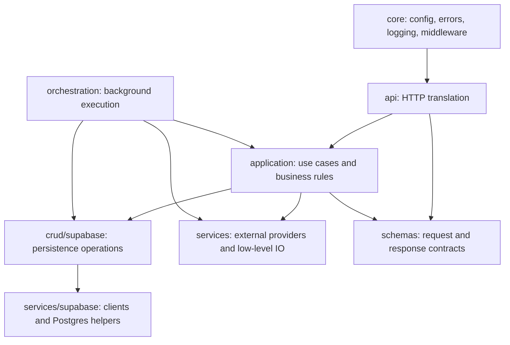

# Repository and code map

This page explains where code belongs and why the repository uses both `apps`
and `packages`. It is the quickest orientation guide before changing code.

## Naming

- **Talven** is the product name shown to users.
- **Fathom** is the repository, Python import, and JavaScript package namespace.

Keeping the technical namespace stable avoids a wide, low-value rename while
the product name is still being evaluated. New user-facing copy should say
Talven. New imports, package names, storage buckets, and repository paths should
continue to use `fathom` until a deliberate migration is approved.

## Why this is one repository

The backend, worker, web application, database schema, and generated client
change together. A session API change often requires a backend schema change,
a regenerated TypeScript contract, and a frontend update. One repository lets
CI test that change as one unit and gives it one review history.

Two repositories become useful when components have genuinely independent
owners, access controls, release cadences, or external consumers. Talven does
not currently have those boundaries. Splitting now would introduce contract
versioning and coordinated releases without isolating an independent team or
product.

## Top-level layout

```text
.
├── apps/
│   ├── backend/          FastAPI package, worker, and backend tests
│   └── web/              Next.js application and browser tests
├── packages/
│   └── api-client/       Generated REST contract and typed web client
├── scripts/              Repository-wide operational and generation tools
├── supabase/             Database migrations, tests, seed, and local config
├── docs/                 Architecture, product, decision, and runbook prose
└── root manifests        Shared Python, Node, CI, and repository configuration
```

`apps` means independently runnable or deployable programs. The API/worker and
the web application have different runtimes and deployment commands, so they
belong there even though they live in one repository.

`packages` means reusable build-time or runtime libraries rather than deployed
programs. `packages/api-client` is generated from the backend's OpenAPI schema
and imported by the web app. Keeping it separate makes the HTTP contract an
explicit boundary instead of burying generated server types inside the UI.

`scripts`, `supabase`, and `docs` are intentionally not inside an app:

- `scripts` operates across applications or external systems.
- `supabase` is deployable database infrastructure shared by API and worker.
- `docs` describes the whole system and its operational decisions.

## Why the root contains several files

The root is a polyglot workspace, so both Python and JavaScript tools need their
standard discovery files there:

| Files | Responsibility |
| --- | --- |
| `pyproject.toml`, `.python-version`, `uv.lock` | Python package, interpreter, and exact dependency graph |
| `package.json`, `pnpm-workspace.yaml`, `pnpm-lock.yaml` | JavaScript workspace, commands, and exact dependency graph |
| `.pre-commit-config.yaml`, `.github/` | Local and shared quality gates |
| `.gitignore`, `env.example` | Repository hygiene and backend configuration template |
| `README.md`, `CHANGELOG.md`, `AGENTS.md` | Onboarding, release history, and contributor guidance |

Moving these files into cosmetic subfolders would break conventional tool
discovery or require more configuration. The lockfiles are not duplicates:
each locks one ecosystem. A developer's root `.env` remains ignored; only
`env.example` is repository documentation.

## Backend map

The import direction should generally move downward in this diagram:



### `api/`

Owns FastAPI-specific behavior: routes, authentication dependencies, request
metadata, response objects, and HTTP status translation. Routers should be
thin. They may call application functions, but application code must not import
`Request`, `HTTPException`, or `StreamingResponse`.

### `application/`

Owns user-facing use cases and business rules. `AuthenticatedUser` is a small
framework-independent identity passed in from the HTTP layer. Major areas are:

- `billing/`: account views, checkout, refunds, recovery, and webhook handling;
- `briefings/`: saved briefings, rendering, and session use cases;
- `briefings/sessions/commands.py`: create/delete behavior;
- `briefings/sessions/queries.py`: session reads;
- `briefings/sessions/streaming.py`: event replay and live stream production;
- `diagnostics/`: operator-facing timelines and health detail;
- `usage.py`: usage admission and settlement rules.

Split a module when it owns distinct operations, not merely because it reached
an arbitrary line count. Handwritten files should normally stay under 500
lines and must have a cohesive reason to exceed it.

### `orchestration/`

Owns background job execution rather than HTTP request orchestration.
`runner.py` claims and supervises jobs; `jobs.py` coordinates a claimed job;
`transcripts.py` and `summaries.py` own their respective pipelines. Provider
calls remain in `services` so the workflow can focus on state transitions.

### `services/`

Owns external IO and provider adapters: YouTube, Groq, OpenRouter, Polar,
Supabase clients, PDF rendering, and retry policy. A service should translate a
provider API into Talven concepts and raise domain errors, not decide an entire
user workflow.

### `crud/supabase/`

Owns database queries and RPC calls. Billing persistence is grouped by database
responsibility (`catalog`, `credits`, `entitlements`, `orders`, `recovery`,
`usage`, and `webhooks`). `billing.py` is a compatibility facade for callers;
it contains no second implementation.

### `schemas/`, `core/`, and `evaluation/`

- `schemas` contains Pydantic transport and structured-content models.
- `core` contains cross-cutting runtime primitives, not feature workflows.
- `evaluation` contains briefing-quality fixtures and evaluation commands.

Backend tests live in `apps/backend/tests` and follow behavior boundaries rather
than mirroring every source file mechanically.

## Frontend map

Next.js owns routing, so route folders under `apps/web/app` are expected:

- `/app`: authenticated product shell;
- `/app/briefings`: library, creation, session streaming, and reading;
- `/app/billing` and `/app/account`: account and payment surfaces;
- `/auth`, `/signin`, and `/signup`: authentication flows;
- `/privacy` and `/terms`: public policy routes;
- `/api/events/marketing`: narrow server-side event proxy.

Code inside a feature route stays near that feature. For example, the briefing
session route composes:

- `useBriefingSession.ts` for network lifecycle and reconnection;
- `sessionStream.ts` for SSE framing and runtime validation;
- `sessionState.ts` for deterministic state transitions;
- `BriefingSessionHero.tsx` and `BriefingReader.tsx` for presentation;
- focused CSS modules that match those component boundaries.

Cross-feature UI belongs in `components`; cross-feature browser utilities and
data access belong in `lib`; static marketing and pricing copy belongs in
`content`; reusable client hooks belong in `hooks`.

Page files should assemble a route. They should not also own a large network
controller, parser, and several independent visual sections. Shared code should
be extracted only after it has a clear consumer and name—DRY does not mean
creating abstractions for coincidental similarity.

## Where new code belongs

Use this order when deciding placement:

1. Is it a deployable entry point or route? Put it in the owning `app`.
2. Is it reusable across workspace applications or generated from their
   boundary? Put it in `packages`.
3. Is it an HTTP concern, business rule, persistence query, provider adapter,
   or background workflow? Choose the matching backend layer above.
4. Is it feature-specific UI? Keep it beside the route; promote it only when
   another feature truly reuses it.
5. Is it database infrastructure, repository automation, or cross-system
   documentation? Use `supabase`, `scripts`, or `docs` respectively.

Avoid new generic folders named `utils`, `helpers`, or `common` unless the
contents have one precise responsibility that the folder name can express.
