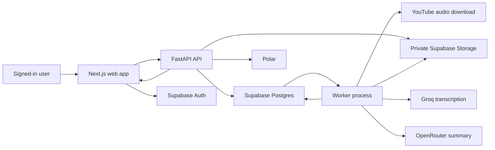
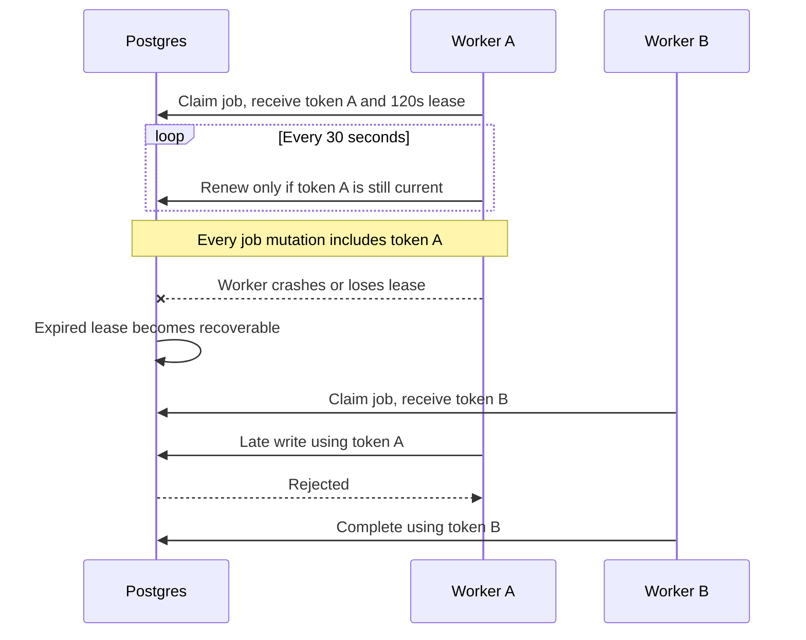

# System and job lifecycle

Talven turns a public YouTube URL into a private, source-linked written
briefing. The API handles authenticated requests, a separate worker performs
long-running work, and Supabase Postgres is both the source of truth and the
job queue. Redis is not part of the current design.

## Component map

The browser never talks directly to Groq, OpenRouter, or Polar. It has limited
read-only access to three RLS-protected database tables, but normal product
requests still go through the API.

## Why there are 14 application tables

The 14 tables are the final public application schema after migrations; the
old Stripe customer table is removed. They do not include Supabase's internal
Auth or Storage tables. The schema separates records that have different
owners, lifecycles, security rules, and audit requirements instead of putting
unrelated mutable data into one large row.

| Table | Purpose |
| --- | --- |
| `jobs` | One user's briefing session, queue state, progress, lease, result link, and archive state |
| `transcripts` | Reusable normalized source text and transcription identity |
| `transcript_segments` | Immutable timestamp ranges used as summary evidence |
| `summaries` | Reusable briefing content and its pending/ready/failed generation ownership |
| `job_events` | Durable progress history for disconnect and replay recovery |
| `plans` | Subscription and pack product definitions |
| `entitlements` | Current per-user subscription, balance, debt, and blocking snapshot |
| `credit_lots` | Individual subscription-cycle and pack grants, consumption, expiry, and refund state |
| `usage_ledger` | Immutable credit and debt movements for audit and reconciliation |
| `usage_settlements` | The unique, atomic final charge for one successful job |
| `billing_orders` | Polar purchases, refunds, and order lifecycle |
| `billing_webhook_events` | Provider-event deduplication, ordering, replay, and diagnostics |
| `polar_customers` | The private mapping between a Talven user and Polar customer state |
| `api_rate_limit_buckets` | Short-lived per-client/per-scope request counters |

For example, `entitlements` is the fast account balance shown now, while
`usage_ledger` is the unchangeable history explaining how it became that
balance. Combining them would make either reads slow or billing history easy
to overwrite. Similarly, user-owned `jobs` are separate from reusable
`transcripts` and `summaries` so two users may benefit from the same processed
source without gaining access to each other's sessions or billing records.

## User request flow

1. The browser sends a public YouTube URL to `POST /briefing-sessions`.
2. The API verifies the signed-in user, normalizes the video identity, checks
   whether this user already has matching work, reads YouTube metadata, and
   performs the current usage-admission check.
3. A database command atomically creates, joins, or reuses the user's session.
4. For new work, the `jobs` row is the queue item. A Postgres notification
   wakes an idle worker quickly; polling remains the fallback.
5. A worker atomically claims the oldest runnable job, downloads the smallest
   suitable audio stream, uploads it temporarily to a private bucket, asks
   Groq for text and timestamped segments, then deletes the temporary object.
6. The worker asks OpenRouter for one strict structured briefing, validates
   every evidence reference, and deterministically renders Markdown.
7. Usage settlement commits once, then one lease-fenced database update marks
   the job successful.
8. Persisted events plus periodic snapshots let the browser recover after an
   SSE disconnect. Markdown and PDF remain private.

## How the database queue works

The `jobs` table stores queue state. A worker claims work through a database
function that:

- chooses the oldest queued job whose retry time has arrived;
- uses `FOR UPDATE SKIP LOCKED`, so concurrent workers do not wait on or claim
  the same row;
- changes the job to `running`;
- creates a random lease token; and
- sets a lease expiry.

The current worker process can run up to 10 jobs concurrently by default.
Several worker processes can run at once because the database performs the
claim atomically.

Postgres `NOTIFY` is only a wake-up hint. If a notification is missed or the
listener reconnects, the worker continues checking the durable `jobs` table.
No job exists only in memory.

## Lease and heartbeat model

A 120-second lease does not mean the worker may run for only 120 seconds. It
means ownership is valid for 120 seconds into the future. A healthy worker
renews that ownership every 30 seconds. The 90-second margin tolerates a short
pause without allowing ownership to remain stale for a long time.

If worker A loses ownership, its next heartbeat or database mutation fails.
Talven cancels its local processing task when the heartbeat reports lease loss.
Even if a thread or remote provider call returns late, token A cannot change
the job, summary, or billing records after worker B owns it.

No application can force a process to exit cleanly after `SIGKILL`, machine
loss, or a container runtime failure. Renewable leases are the recovery
mechanism for exactly those cases.

Normal shutdown, cancellation, lease loss, retry, and stale-job recovery emit
structured lifecycle logs with correlation and job identifiers. A process
that is forcibly killed cannot emit a final log; the expired lease and later
reclaim are the observable evidence from the surviving database and worker.

## Retries and deadlines

| Layer | Current behavior |
| --- | --- |
| One Groq/OpenRouter stage | Up to three Talven-controlled attempts inside one total stage deadline |
| SDK | Automatic SDK retries are disabled with `max_retries=0` |
| Temporary/rate-limit error | Bounded exponential backoff with jitter; honors bounded `Retry-After` |
| Permanent provider rejection | Fails without retrying the same invalid request |
| Whole job | Up to three worker claims, with a later `run_after` time |
| Billing finalization failure | Returns to a visible `finalizing` retry state; the ready result remains hidden |

Disabling SDK retries does not disable retries altogether. It prevents an
invisible second retry loop inside the SDK. Talven owns the retry count,
classification, delay, cancellation, logging, and deadline, so there is one
place to understand the behavior.

The worker currently has stage deadlines, but no separately measured
end-to-end job deadline. Do not choose that number arbitrarily. Measure real
provider timings in a capped staging rehearsal first, then set a percentile-
based limit with enough margin for valid long inputs.

## Graceful shutdown

On `SIGTERM` or `SIGINT`, a worker:

1. stops claiming new jobs;
2. gives active tasks the configured grace period, 30 seconds by default;
3. cancels tasks still running after the grace period; and
4. releases process resources.

Cancelled download code removes partial local files. If the process disappears
without running cleanup, its lease expires and another worker can reclaim the
job. A repeated provider charge is still possible if the process dies after a
provider accepted work but before Talven persisted the result. Fencing prevents
data corruption and double billing; it cannot refund an external provider call
that already happened.

## Summary and event lifecycles

Summary rows have explicit `pending`, `ready`, and `failed` states. A pending
row has one generation token tied to one live job lease. Another worker may
take over only when that producer failed or became orphaned. Only a non-empty
`ready` summary connected to the user's successful or archived job is readable
from the browser.

Job events are persisted with one database sequence that never resets per
connection. The SSE endpoint replays events after `Last-Event-ID`, then tails
for new events. A full session snapshot is the reconciliation fallback.
Current tailing performs roughly one event query per active viewer per second,
plus a less frequent snapshot query. That is acceptable for a bounded pilot;
measure it before adding a shared wake-up or retention system.

## Primary code paths

- API entry: `apps/backend/fathom/api/app.py`
- Session creation and streaming:
  `apps/backend/fathom/application/briefings/sessions.py`
- Worker loop: `apps/backend/fathom/orchestration/runner.py`
- Per-job orchestration: `apps/backend/fathom/orchestration/jobs.py`
- Transcript pipeline: `apps/backend/fathom/orchestration/transcripts.py`
- Summary pipeline: `apps/backend/fathom/orchestration/summaries.py`
- Provider retry policy:
  `apps/backend/fathom/services/provider_resilience.py`
